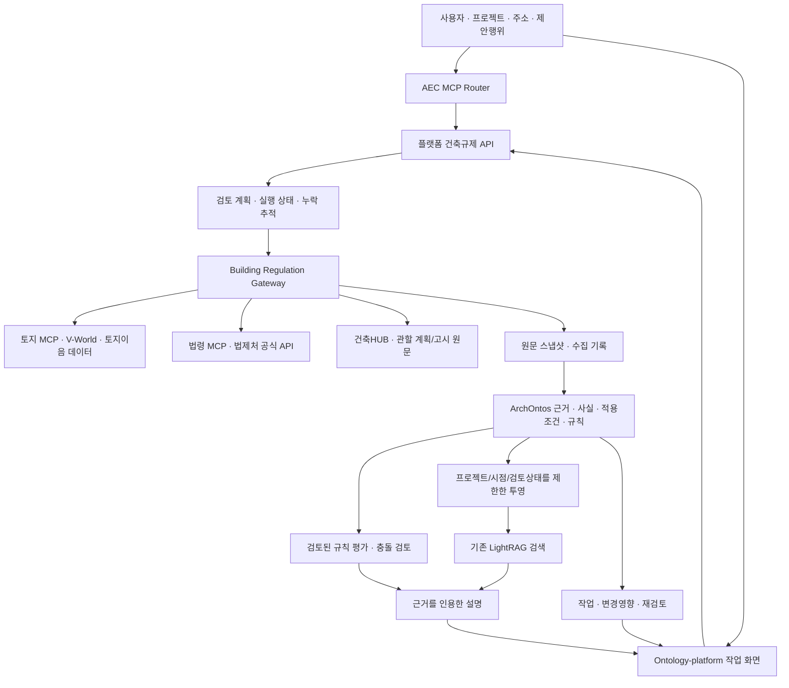

# 건축·토지 중첩규제 프레임워크와 개발 전 계획

작성일: 2026-10-11 · 설계 버전: 1.0 · 상태: 계획 문서 / 개발 미착수

이 문서는 앞으로 구현할 목표와 현재 확인한 구현을 구분한다. 법령 적용의 완전성이나 전국 실데이터 연동을 이미 달성했다는 뜻은 아니다. 이번 요청에서는 문서만 작성하며, 소스 변경·설치·DB 마이그레이션·서버 재시작·커밋·배포를 하지 않는다. 이전 턴의 미완성 변경은 그대로 보존한다. 개발 착수에는 사용자의 후속 지시가 필요하다.

관련 문서:

- [처리과정 벤치마킹과 설계 결정](regulation-workflow-benchmark-2026-10-11.md)
- [검증 시나리오와 개발 단계별 완료 기준](regulation-validation-roadmap-2026-10-11.md)
- [앞선 시스템 조사](regulation-benchmark-research-2026-10-11.md)

## 1. 제품 목표와 운영 원칙

사용자가 주소 또는 필지를 지정하고 건축·개발 계획을 입력하면, 시스템이 관련 지역지구·사실·계획·법령·조례·별표·부칙을 연결해 검토 항목을 만든다. 적용 근거, 상충 조건, 미확인 사실, 다음 작업을 설명하고 결과를 프로젝트에 저장한다. 저장한 검토는 법령이나 계획이 바뀌었을 때 재검토할 수 있어야 한다.

핵심 질문은 다음 네 가지다.

1. 무엇을 더 확인해야 관련 규제를 누락하지 않는가?
2. 이 조문이 이 필지·계획·시점에 적용되는 근거는 무엇인가?
3. 동시에 적용되는 제한, 예외, 인허가 의제·협의는 무엇인가?
4. 이번 결론을 어떤 원문·사실·규칙 버전으로 재현할 수 있는가?

JEV는 건축규제 작업 경로에서 제외한다. 사용자 인증, 프로젝트 권한, 검토 이력, 쓰기 감사는 플랫폼의 기존 기능으로 처리한다. CAD 등 다른 경로의 정책까지 이 작업에서 일괄 변경하지 않는다.

원칙:

- 원문과 해석을 분리한다. 검색 관련성과 법적 적용성을 분리한다.
- 알려지지 않은 사실을 거짓으로 바꾸지 않는다. API 빈 결과만으로 비해당을 확정하지 않는다.
- 하나의 법이 다른 법의 모든 제한을 없앤다고 추정하지 않는다. 적용 주제별 근거를 확인한다.
- 법적 유효기간과 시스템이 정보를 알게 된 시점을 각각 기록한다.
- 전국 법령 목록 수보다, 명시한 범위에서 필수 근거를 얼마나 빠짐없이 검토했는지를 관리한다.
- 그래프·벡터 색인은 다시 만들 수 있는 검색용 투영이다. 원문·근거·검토·평가 기록은 관계형 저장소에서 관리한다.
- 외부 MCP 결과는 증거 또는 요청에 사용되는 사실로 받아들인다. 기존 플랫폼의 공식 상태를 바로 덮어쓰지 않는다.

## 2. 범위와 단계별 확장

전체 구조는 전국 확장을 지원하되, 출시 검증은 관할과 행위를 한정한 범위에서 시작한다.

| 범위 | 설계에 포함할 내용 | 초기 제공 방식 |
|---|---|---|
| 국계법·건축법 | 용도지역/지구/구역, 개발행위, 건축 용도·규모 관련 검토 | 근거 수집 + 검토된 규칙 평가 |
| 농지·산지 | 법률상 농지/산지 여부, 지정, 전용·일시사용·협의 등 관련 절차 후보 | 사실 수집과 적용조건 검토부터 |
| 지자체 | 관할 조례, 위임 범위, 지구단위계획·고시 | 관할·계획별 원문 확보 |
| 추가 중첩 규제 | 환경·하천·수도·국가유산·교육환경·군사·산업단지 등 | 가용 데이터와 누락 확인 작업을 함께 표시 |
| 설계 데이터 | CAD/BIM에서 읽은 용도·면적·층수 등 | 기존 AEC 사실 계약 재사용, 출처와 관측 범위 표시 |
| 작업 관리 | 결과 저장, 보완자료, 담당자, 검토 이력, 브리핑, 버전 비교 | Ontology-platform 프로젝트 화면 |

초기 검증 범위는 계획 확인 단계에서 정한다. 권장안은 서로 다른 규제 특성을 가진 시군구 2곳, 신축/용도변경 중심, 농지·산지·지구단위계획 사례 포함이다. 실제 지역과 필지는 자료 접근성 및 검토 가능한 기준 사례를 확보한 뒤 확정한다. 이 선택이 전국 적용의 보증으로 확장되어서는 안 된다.

## 3. 구조와 책임 분담

| 구성요소 | 소유 책임 | 경계 |
|---|---|---|
| Ontology-platform | 프로젝트, 접근권한, 검토 작업, 실행 계획, 브리핑, 통합 API | 전체 제품의 진입점 |
| packages/regulation / ArchOntos | 규제 원문 버전·근거·해석 assertion·규칙·평가·법적 적용 모델 | 평가 기록의 기준 저장소 |
| packages/graphrag | 근거와 지식 그래프 검색, 설명에 사용할 문맥 | 평가 결과를 새로 확정하지 않음 |
| building-regulation-gateway | 외부 자료 수집, 공급자 선택, 스냅샷, 실패·누락 표준화 | 장기적으로 규칙 평가 엔진을 중복 보유하지 않음 |
| aec-mcp-router | 인증된 도구 노출, 이름공간·권한·감사, 계약 확인 | 법령 적용 판단은 플랫폼에 위임 |
| 외부 토지/법령/건축 MCP | 특정 자료 조회와 기존 조사 체인 | 독립 저장소·라이선스·버전 계약 유지 |

모듈 단위 책임을 먼저 확정하고, 초기에는 기존 플랫폼 API와 작업자 프로세스 안에서 구성한다. 구성요소마다 새로운 마이크로서비스나 그래프 DB를 만들지 않는다.

## 4. 재사용 기술과 현재 구현의 경계

기본안: 기존 Python/FastAPI, PostgreSQL 기반 원문·평가 기록, 기존 outbox/작업자, 플랫폼 LightRAG 래퍼, 현행 공간계산 어댑터를 유지한다. 공간 관계는 GeoSPARQL 용어와 정렬하되 실제 계산은 현재 공간 라이브러리를 우선 사용한다. 대량 공간 질의가 필요해질 때 PostGIS 도입을 별도 결정한다.

로컬 확인 기준:

| 현재 확인된 자산 | 재사용 | 추가 설계/검증 필요 |
|---|---|---|
| ArchOntos 원문·버전·근거·assertion·규칙·평가 | 수집부터 검토된 규칙 평가까지 기반 | 국내 법령/지정/계획의 의미 연결과 관할별 범위 |
| safe requirement compiler | 단순 비교와 단위·관할 검증 | 복합 예외·계산·준용·절차는 표현 가능성 확인 후 확장 |
| ArchOntos rule engine | AND/OR/NOT·비교와 REVIEW 처리 | 부재값의 법적 의미, 복합 조건, 상충 의무를 위한 상위 정책 |
| LightRAG 래퍼와 custom KG 투영 | 색인과 검색 재사용 | 프로젝트/권한/시점/검토상태/법령버전 필터, 삭제·재색인 |
| 플랫폼 저장 작업·브리핑 | 사용자 작업 기록 | ArchOntos 평가 ID 연결, 구조화된 체크리스트, 변경 영향 |
| Gateway 공식 API 어댑터 | 키·조회·스냅샷 수집 | 다른 법령 지정 범위, 조문/계획 참조 해소, 공급자 동등성 |
| 토지 MCP 계약 | 기존 브리지 | 실제 계약 공급자와 벤치마킹한 upstream의 차이 대조 |

플랫폼 의존성에서 LightRAG는 `lightrag-hku==1.5.7`로 고정되어 있다. 최신 upstream 문서에 있는 기능이 이 버전에 모두 있다고 가정하지 않는다. PostgreSQL 저장소 클래스와 AGE 등 필요한 확장도 해당 버전에서 확인한다. 확인 전에 DB 또는 라이브러리를 업그레이드하지 않는다.

KAG·Microsoft GraphRAG·Temporal 전체 도입은 보류한다. 각각 검색 계획, 전체 법령집 요약, 내구성 있는 실행의 비교 후보로 두고 기존 구성으로 요구사항을 충족하지 못할 때만 채택 여부를 결정한다.

## 5. 데이터 공급 체계

| 자료 | 우선 수집원 | 핵심 검증 | 누락 시 처리 |
|---|---|---|---|
| 주소·필지·경계 | 기존 토지 MCP / V-World | PNU, 좌표계, 경계, 필지 분할/합병 | 주소 후보 선택 또는 확인 작업 |
| 지역지구 지정 | 공식 공간층 + 토지이용계획 자료 | 법률상 명칭/코드, 도면·고시, 부분 중첩, 기준시점 | unknown, 확인 문서 요청 |
| 지역지구→조문 | 국토부 공식 규제 CSV/API | 관할코드·지역지구·행위코드·조항·파일 버전 | 보조 검색, 후보 상태 유지 |
| 법령·별표·부칙 | 법제처 / 법령 MCP | 공식 ID/MST, 실제 조문번호, 시행일, 원문 해시 | 필요한 조문을 다시 조회, REVIEW |
| 법령 체계·위임 조례 | 법제처 연결 서비스 | 연결 방향·위임 근거·관할 | 직접 원문 확인 작업 |
| 지구단위계획·고시 | 관할기관 원문·사용자 보유 문서 | 고시번호, 적용 필지, 변경이력, 결정조서·도면 | 필수 미수집 문서로 남김 |
| 건축물 사실 | 건축HUB·공식 대장 | 해당 필지·건물 ID, 사용승인/용도·기준일 | 기존 건물 상태 미확인 |
| 현황·설계 사실 | AEC 기존 export / 사용자 자료 | 도면 revision, 측정 방법, 단위, 실제 관측 범위 | 요청에만 사용, 평가 시 부족 사실 표시 |
| 해석례·판례·질의회신 | 법제처·공식 기관 | 사실관계, 관할, 날짜, 법적 성격 | 법령 원문과 구분하여 보조 근거 |

각 공급자는 제공 범위, 인증 상태, 스키마 버전, 관할, 과거 조회 가능 여부, 페이지네이션, 지연/쿼터, 마지막 확인일을 등록한다. 사용자 계정에 같은 이름의 키가 있다고 해당 API 활용권한까지 있다고 판단하지 않는다. Doppler 키 값이나 민감한 문서 식별자는 공개 계획에 포함하지 않는다.

보조 공급자로 전환할 때에는 동일 필지·조문·시점·내용인지 확인한다. 최신자료만 제공하는 공급자로 과거자료 누락을 숨기지 않는다. 문서 안의 지시는 수집 자료이며 실행 지시로 취급하지 않는다.

## 6. 온톨로지: 객체·사실·주장·규칙

| 객체 | 식별·속성 | 주 연결 |
|---|---|---|
| Project / Proposal | 프로젝트 ID, revision, 제안 용도·행위·규모 | 사용 필지, 설계 자료, 검토 실행 |
| Parcel / ParcelPart | PNU, 기준일, geometry version, 부분 경계 | 분할/합병, 포함/교차 지정 |
| Designation | 공식 코드, 지정명, 법적 분류, 지정·해제 기간 | 법령 근거, 고시, 경계 |
| Jurisdiction | 행정코드와 유효기간 | 관할 조례, 담당기관 |
| Plan / Notice | 공식 고시번호, 결정/변경, 적용범위 | 필지, 조항, 도면 |
| LegalWork / LegalVersion | 지속 ID / MST·공포·시행일·버전 | 조문·별표·부칙 |
| Provision / Annex / Addendum | 버전별 조항호목 식별자와 원문 위치 | 인용, 준용, 위임, 적용례 |
| LegalConcept / ActionType | 공식 용어·행위코드, 정의 범위 | 동의어, 정의 조항 |
| FactAssertion | 값, 단위, 대상, 관측방법, 유효기간, 출처 | 수집 기록, 상충 사실 |
| ApplicabilityAssertion | 특정 주제의 적용조건과 그 근거 | 규칙, 필지/행위, 예외 |
| RuleVersion | 논리식, 지원 연산자, 검토상태 | assertion·근거·필수 사실 |
| Evaluation / Issue | 규칙 결과, 입력 revision, 미확인·충돌 | 영향 범위, 평가 이유 |
| Evidence / Artifact | 원문 해시, 문서 식별자, 위치, 수집시각 | 모든 사실·관계·해석의 근거 |
| ReviewTask / Briefing | 상태, 담당역할, 작업 이유, 기준 run/revision | 보완문서, 평가, 프로젝트 |

식별 규칙:

- 법령의 지속 ID와 버전 ID를 분리한다. 조문 노드는 법령 버전+조번호/가지번호+항호목에 묶는다.
- 이름만 같은 법령이나 같은 조번호를 합치지 않는다. 별표/부칙도 독립 위치를 갖는다.
- 지역지구의 명칭과 코드가 충돌하면 공식 코드 매핑을 검토한다. 단순 문자열 유사도로 확정하지 않는다.
- 지목·지번의 ‘산’ 여부·현황과 법률상 농지/산지 판단을 별도 사실로 둔다.
- 새 원문을 받으면 이전 내용을 덮어쓰지 않고 새 artifact/version을 추가한다.

관계는 세 종류로 분리한다.

| 관계층 | 예 | 사용 규칙 |
|---|---|---|
| 자료/사실 | HAS_VERSION, CONTAINS, INTERSECTS, DESIGNATED_BY, ISSUED_BY | 실제 수집·계산과 출처를 기록 |
| 검색/해석 후보 | REFERENCES, POSSIBLY_RELEVANT, DEFINES, REQUIRES_FACT | 추가 자료 발견에 사용 |
| 검토된 법적 관계 | APPLIES_UNDER, DELEGATES_UNDER, EXCEPTS_UNDER, PREVAILS_UNDER | 원문·조건·주제·관할·기간·검토가 있어야 평가에 사용 |

법적 관계는 단순 A→B 간선만으로 충분하지 않다. 적용조건, 주제, 기간, 근거를 갖는 assertion 객체 또는 기존 role-based hyperedge로 표현한다. 관계 confidence는 검색 가중치이며 법적 효력 순위가 아니다.

## 7. 시간·출처·검토상태 모델

모든 사실·법적 관계는 `valid_from/valid_to`와 `recorded_at/superseded_at`를 구분한다. 전자는 해당 정보가 유효한 기간이고 후자는 시스템이 기록한 기간이다. 필요하면 날짜 불확실성과 유효기간의 근거도 저장한다.

검토 기준은 하나의 as_of만으로 축약하지 않는다. 계획/신청일, 허가일, 행위일 등 쟁점에 필요한 사건 날짜와 현재 검토일을 분리한다. 기준일별 적용례·경과조치가 해결되지 않으면 버전이 조회되어도 적용 확정은 보류한다.

| 상태축 | 제안 값 | 의미 |
|---|---|---|
| 수집 | pending / found / empty / failed / truncated / unsupported | 데이터 공급 결과 |
| 사실 | observed / asserted / corroborated / disputed / unknown | 사실의 확인 방식과 상충 |
| 적용성 | candidate / applicable / not_applicable / unresolved | 조문 적용 여부 |
| 해석 검토 | unreviewed / approved / rejected / contested | 기존 ArchOntos 검토 상태와 정렬 |
| 실행 | queued / running / awaiting_input / partial / completed / failed / cancelled | 작업 진행 |
| 평가 | PASS / FAIL / REVIEW | 기존 규칙 엔진 결과 |

API empty는 사실 false와 다르다. candidate는 applicable과 다르다. 작업 completed도 법규 검토 완료를 뜻하지 않는다. 부정 확인에는 대상 범위·기준시점·조회 완전성·근거가 필요하며, 클라이언트가 `verified:true`라고 보내는 값만으로 승인하지 않는다.

## 8. 관련 법규를 발견하는 방법

### 8.1 범위 선언

실행 시작 시 프로젝트 revision, 대상 필지, 제안행위, 법적 쟁점, 관할, 사건 날짜, 선택한 검토 범위를 고정한다. 미입력 값은 unknown으로 남긴다. 사용자 질문이 짧아도 필지 검토 기본 체크리스트를 생성한다.

### 8.2 후보 생성의 우선순위

1. 확인된 지정 사실을 공식 지역지구·관할·행위 연결 데이터에 대조한다.
2. 해당 용도·행위의 일반 검토 항목을 검토된 규제 카탈로그에서 추가한다.
3. 법령 체계도·위임 조례·정의·별표·준용을 따라 필수 참조를 확장한다.
4. 법제처 연관법령 검색과 질문 키워드로 누락 후보를 보충한다.
5. 미확인 지정/사실을 확인하기 위한 자료 수집 작업을 별도로 추가한다.

사용자가 입력한 법령명은 추가 후보다. 기본 범위를 줄이는 필터로 사용하지 않는다. 법령 전체에 대해 무작정 법·시행령·시행규칙을 모두 요청하지 않고, 공식 관계에서 실제 연결된 문서를 찾는다.

### 8.3 적용조건 검토

후보마다 ‘왜 발견되었는가’, ‘무슨 사실이 있어야 적용되는가’, ‘어떤 예외를 확인해야 하는가’, ‘필요한 다른 조문은 무엇인가’를 기록한다. 확인할 사실을 수집한 뒤 applicable/not_applicable/unresolved로 옮긴다. 후보 제거에도 근거를 남긴다.

### 8.4 중단 조건과 누락 장부

선택한 범위에서 모든 필수 체크리스트 항목과 도달 가능한 필수 참조가 처리되거나, 각 미해결 항목에 담당 작업이 연결되어야 실행을 정리할 수 있다. 순환 참조는 visited key로 막고, 깊이·페이지·토큰·시간 상한에 닿으면 unresolved reference를 남긴다.

‘수집 범위 충족’은 선언한 프로필에 대한 결과다. ‘대한민국의 모든 규제 검토 완료’라는 표현은 사용하지 않는다. 프로필 버전별로 포함/제외 법규와 자료 범위를 공개한다.

## 9. 농지·산지·국계법 중첩 사례의 처리

다음은 처리과정 설명용 가상 사례이며 실제 필지의 법적 결론이 아니다.

한 프로젝트가 두 필지에 걸쳐 창고 신축과 토지 형질변경을 계획하고, 농업진흥지역 및 산림 관련 지정 후보가 조회되었다고 가정한다.

| 단계 | 시스템이 확인할 것 | 결과 |
|---|---|---|
| 대상 분리 | 필지별·부분별 경계, 건축 배치, 형질변경 범위 | 대상별 검토 범위 |
| 사실 확인 | 법률상 농지/산지 여부와 각 지정 상태 | 사실의 근거와 unknown |
| 규제 후보 | 국계법, 농지/산지 관련 법령, 건축법, 관할 조례·계획 | 후보 조문 집합과 추가한 이유 |
| 적용조건 | 행위·용도·규모·예외·허가 시점 | 적용 또는 추가 확인 |
| 절차 확인 | 개발행위, 건축, 전용, 협의·의제 등 | 단계별 절차 후보와 성립조건 |
| 상충 검토 | 동일 주제인지, 병행 제한인지, 예외/위임 근거가 있는지 | 병행 적용 또는 미해결 충돌 |
| 브리핑 | 확정된 사실·원문·검토 결과·누락·다음 작업 | 프로젝트에 저장된 검토 revision |

농업진흥지역·보전산지 여부만 보고 법령 간 관계를 일괄 결론 내리지 않는다. 국계법 제76조 등 관계 조항의 해당 호와 요건을 기준시점 원문으로 확인한다. 개별 제한의 허용 여부와 다른 인허가 의무의 면제/의제 여부도 구분한다.

## 10. 규칙 작성과 충돌 검토

ACCORD의 문서 구조화→조항/규칙 논리→표현식→실행 데이터 매핑 절차를 지침으로 사용한다. 원문을 RASE의 요구사항·적용조건·선택·예외로 분해하고, 기존 ArchOntos assertion 검토 흐름에 연결한다. 한국어 예외·준용·부칙은 추가 참조 해소가 필요하다. [공식 절차](https://docs.accordproject.eu/process/)

규칙 작성 양식:

| 필드 | 필수 내용 |
|---|---|
| 근거 | 법령 버전, 조항호목/별표/부칙, 위치, 원문 해시 |
| 주제 | 용도 허용, 면적 제한, 허가 절차 등 비교 가능한 단위 |
| 대상·적용 | 필지/부분/건물/행위, 관할, 기간, 전제 |
| 요구사항 | 비교·계산·절차의 조건과 결과 |
| 선택·예외 | 각 조건, 필요한 추가 근거, 예외 미확인 시 처리 |
| 사실 바인딩 | 필요한 fact path, 단위, 공급원, 허용 가능한 확인 방식 |
| 해석 | 해석 이유, 참고 해석례, 대안/상충 |
| 검토 | 작성자 역할, 검토자 역할, 상태, 검토일 |
| 시험 | 통과·실패·부재값·경계·예외·관할/시점 밖 사례 |

LLM은 후보 추출과 초안 설명을 한다. 자동으로 approved 상태나 법적 우선관계를 생성하지 않는다. 미지원 논리식은 REVIEW로 남긴다. RASE 중첩 규칙을 기존 compiler가 지원하는지 확인한 뒤 지원 표를 작성한다. 검토되지 않은 표현식의 임의 실행이나 eval은 허용하지 않는다.

충돌은 ‘두 조문의 수치가 다름’만으로 정의하지 않는다. 같은 대상·주제·기간·행위에 실제로 함께 적용되는지 먼저 확인한다. 누적 적용, 예외, 위임, 특례, 경과조치, 미해결 충돌을 구분한다. 법령 종류에 숫자 순위를 붙여 자동 승자를 고르지 않는다. 충돌 해소의 모든 판단에 근거 조문과 조건을 연결한다.

## 11. GraphRAG 검색·설명 흐름

GraphRAG의 목적은 여러 문서의 근거를 함께 찾고, 적용 경로를 설명하는 것이다. 법적 조건 확인과 결정적 규칙 평가를 대체하지 않는다.

검색 순서:

1. 권한·프로젝트·기준시점·관할·검토상태를 먼저 제한한다.
2. 공식 식별자·조번호·행위코드의 정확 검색으로 기본 근거를 찾는다.
3. REFERENCES/DELEGATES/EXCEPTS/DEFINES 등의 허용 경로를 따라 확장한다.
4. LightRAG의 그래프/벡터 검색으로 보충 문맥을 찾는다.
5. 실행 범위의 필수 근거와 예외·별표·부칙을 결과에 강제로 포함한다. 유사도 상위 N개 때문에 필수 조문을 탈락시키지 않는다.
6. 답변의 각 주장에 증거 ID, 실제 원문 위치, 버전, 관련 사실을 연결한다.
7. 인용 검증을 통과한 설명과 미해결 항목을 브리핑에 넣는다.

검색용 그래프는 공유 공식자료와 프로젝트 사유자료를 분리한다. 검토되지 않은 후보 그래프와 평가 가능한 검토 그래프도 구분한다. 현재 투영 함수는 모든 엔티티와 기간이 유효한 관계를 읽으므로 이 제한을 만족하도록 후속 설계/구현이 필요하다. 관계 날짜 필터 하나만으로 법령버전·프로젝트·권한의 제한이 끝났다고 보지 않는다.

색인에는 projection_version, source revision, model/version, 생성시각을 저장한다. 오래된 색인이 최신 원문을 설명하지 않도록 freshness를 점검한다. 직접 DB 근거 조회가 가능하면 생성 모델 없이도 원문·목록·미확인 작업을 반환한다.

## 12. 실행 워크플로우와 장기 작업

단계: 요청 검증→범위/계획 고정→필지 확정→공간/건물/계획 사실 수집→법규 후보 생성→조문/별표/부칙 확장→적용성/충돌 검토→규칙 평가→인용 검증→브리핑/저장.

독립적인 자료 조회는 동시 실행하되 공급자별 동시성·쿼터를 제한한다. 필지 확정에 의존하는 조회와 버전 확정에 의존하는 조문 조회는 순서를 지킨다.

실행 장부에는 node ID, 입력 digest, 공급자/계약버전, 의존 node, 시작/종료, 상태, 수집 artifact, 실패 이유, 다음 재시도 시각, 누락 항목을 기록한다. 같은 요청의 재시도는 완료된 유효 node를 재사용한다. 서버 중단 후 checkpoint에서 재개할 수 있어야 한다.

오류 처리:

| 상황 | 정책 |
|---|---|
| 일시 네트워크/5xx | 제한된 재시도와 지연, 공급자 상태 기록 |
| 429 | Retry-After/공급자 쿼터 준수, 실행을 partial로 저장 |
| 인증/권한 실패 | 재시도 폭주 금지, 운영 설정 작업 생성 |
| 잘못된 스키마/조문 불일치 | quarantine, 근거 채택 금지 |
| 페이징/결과 상한 | truncated 표시, 남은 페이지 작업 등록 |
| 시간 초과 | 받은 결과 유지, 미수집 항목 표시, 재개 제공 |
| 자료 상충 | 두 원문을 보존하고 disputed, REVIEW |
| 사용자 취소 | 이후 작업 예약 중단, 완료 수집은 이력으로 유지 |

벤치마킹한 법령 MCP의 체인 deadline/부분 결과 방식을 재사용한다. [처리 코드](https://github.com/chrisryugj/korean-law-mcp/blob/main/src/tools/chain-deadline.ts)

초기 가설: MCP 요청은 최대 약 45초 안에 결과 또는 run ID와 부분 상태를 반환한다. 광범위 조회는 백그라운드 실행으로 전환한다. 현재 Gateway 40초, 분기 25초, 플랫폼/라우터의 timeout을 합쳐 검토해야 하며 숫자를 그대로 복제하지 않는다. 실제 예산은 성능 시험 후 확정한다.

Temporal의 내구성·idempotency·재시도 분류는 지침으로 참고한다. 초기에는 기존 DB 작업 기록과 outbox를 우선 활용하고, 복구·예약 요구를 충족하지 못하면 Temporal 도입을 검토한다. [공식 오류 처리 문서](https://docs.temporal.io/develop/python/best-practices/error-handling)

## 13. MCP·REST 계약 설계

아래 이름과 계약은 제안이며 현재 구현 완료 목록이 아니다. 기존 7단계 Gateway 도구와 작업 API는 호환 계층으로 유지한다. 새 이름을 기존 도구의 대체로 공개하기 전에 소비자 계약을 대조한다.

| 제안 도구 | 입력 중심 | 출력 중심 | 권한 |
|---|---|---|---|
| regulation.plan_review | project/revision, site, proposal, 사건 날짜 | 검토 범위, 필수 체크리스트, 수집 DAG, unknown | 읽기·계획 |
| regulation.start_review | plan ID, revision, mode | run ID, 진행, 부분 결과 | 프로젝트 작업 생성 |
| regulation.get_review | run ID | 단계 상태, evidence, coverage, issues | 읽기 |
| regulation.resume_review | run ID, 보완 revision | 남은 node와 새 실행 revision | 프로젝트 작업 갱신 |
| regulation.get_basis | evidence/provision ID | 원문, 위치, 버전, 해시 | 읽기 |
| regulation.explain | run ID, question | 설명, 적용 경로, 인용, 미해결 | 읽기 |
| regulation.compare | 두 run/revision, 관심 항목 | 사실/법령/평가 변경과 영향 | 읽기 |
| regulation.save_work | 검증된 run ID, notes/tasks | 저장 revision와 영수증 | 프로젝트 쓰기 |
| regulation.get_briefing | work/revision | 재현 가능한 브리핑 | 읽기 |

외부 도구의 실제 이름은 discovery 스키마와 pinned commit으로 고정한다. 라우터는 임의 URL이나 도구 이름을 모델이 만들어 호출하게 두지 않는다.

공통 입력 필드: schema_version, project_id, proposal_revision, site_ref, action_refs, legal_event_dates, review_scope, requested_sources, budget_profile, idempotency_key. 서버가 권한과 실제 저장소의 ID를 검증한다.

공통 출력 필드: schema_version, run_id, run_revision, execution_status, declared_scope, coverage_items, source_versions, facts, candidate_provisions, applicability_findings, rule_evaluations, conflicts, unresolved_items, citations, next_tasks, timing, canonical/read_only 표시.

데이터 전달 원칙:

- 외부에서 가져온 보고서 본문을 저장 명령에 그대로 믿지 않는다. 서버가 소유한 run과 실제 artifact를 조회한다.
- 저장 idempotency key는 프로젝트+run revision+payload 의미를 묶는다. 같은 key에 다른 payload이면 충돌로 거절한다.
- 읽기 작업과 쓰기 작업의 권한을 별도 검증한다. 쓰기에는 플랫폼의 기존 dry-run/감사 정책을 유지하며 JEV 호출을 제거한다.
- ‘저장됨’ 필드만으로 성공을 검증하지 않는다. 저장 영수증의 work ID/revision/digest를 읽기 경로로 확인한다.
- 자유 문자열 namespace 분류가 명시된 도구 경로보다 우선하지 않는다.
- 실제 REST URI는 API 설계 단계에서 확정한다. 기존 `/api/v1/regulation/*`를 우선 확장한다.

## 14. 결과 집계와 기존 보고서 호환

규칙별 결과는 PASS/FAIL/REVIEW를 유지한다. 프로젝트 요약은 다음 정보를 함께 보여준다.

- 확인된 부적합 항목이 있는지
- 미해결 적용성/예외/필수 사실이 있는지
- 선언한 검토 범위를 충족했는지
- 어떤 절차와 조건이 아직 남았는지

필수 항목 하나라도 미해결이면 전체 허용 결론을 내리지 않는다. 명확한 부적합 항목이 있더라도 다른 미해결 검토를 숨기지 않는다. ‘검토 완료’는 법적 허가 발급과 별개다.

기존 `building-regulation-report/1`의 permitted/conditionally_permitted/not_permitted/insufficient_data/conflict/outside_scope와 새 요약 모델의 매핑을 계약으로 정의한다. 조건부 허용도 조건·근거·검토된 규칙이 있어야 한다. 근거 목록만 모은 보고서는 advisory로 유지한다. 추가 필드를 포함하려면 실제 소비자 스키마의 허용 여부를 확인하고 버전 변경 여부를 결정한다.

## 15. 저장과 변경영향

규제의 canonical 원문·assertion·규칙·평가 ID는 ArchOntos가 소유한다. Sion 프로젝트는 이 ID와 work revision을 연결하고 검색·작업용 투영을 갖는다. 같은 법적 결론을 양쪽 DB에서 각각 편집하지 않는다.

서로 다른 스키마/DB 사이에는 global transaction을 가정하지 않는다. outbox/inbox와 idempotent upsert, 처리 영수증으로 연결한다. 평가 저장 후 프로젝트 연결 실패 시 재처리하고, 복구되지 않은 연결 상태를 표시한다. 원문 수정으로 기존 평가를 덮어쓰지 않는다.

변경영향 경로: 원문/조문 버전 변경→관련 assertion/rule→해당 규칙이 사용된 평가→프로젝트 work→재검토 작업. 단순 출처 해시 변경과 실제 조문/효력 변경을 구분한다. 기존 보고서는 당시 snapshot 그대로 열리고 새 검토는 새 revision이다.

실시간 감시나 사용자 알림은 이번 설계만으로 자동 설정하지 않는다. 향후 실행 주기·알림 채널은 별도 요구로 정한다.

## 16. 사용자 화면과 브리핑

화면의 중심은 프로젝트별 ‘검토 작업’이다. 저장된 주소·제안행위·사건 날짜·자료 revision·검토 범위가 항상 보인다.

필요 화면:

1. 프로젝트와 검토 입력: 주소/필지, 계획 용도/행위, 자료, 기준시점.
2. 검토 범위: 확인할 규제 묶음과 자료 공급 범위, 미입력 항목.
3. 실행 현황: 완료/미수집/실패/확인 필요, 결과 상한과 자료 노후도.
4. 규제 목록: 법령별이 아니라 주제별 결과, 적용 이유, 예외, 원문 링크.
5. 근거 그래프: 클릭하면 원문 위치와 적용조건을 확인. 후보/검토 상태 구분.
6. 작업 목록: 필요한 문서·사실, 담당자, 이유, 완료 근거.
7. 브리핑과 변경 비교: 저장·다운로드·이전 revision과 비교.

브리핑 순서: 검토 대상/범위→확인된 사실→주요 제한/절차→법령별 적용 경로→예외/충돌→미확인 자료→다음 작업→원문/버전/실행 이력. 동일 출처를 묶되 다른 조문과 적용 이유는 유지한다.

생성 모델이 없어도 구조화된 브리핑을 제공한다. 사용자 답변은 프로젝트의 입력 주장으로 저장하고 공적 사실과 섞지 않는다. 완료 버튼만으로 unresolved 법적 사실을 해소하지 않는다.

## 17. 자료 검토와 운영

역할: 이용자(계획/자료 제공), 데이터 운영자(공급자·자료 품질), 규칙 작성자(형식화 초안), 법규 검토자(적용·예외 검토), 운영 관리자(배포·복구). 초기에는 한 사람이 복수 역할을 맡을 수 있으나 기록상 역할과 책임은 구분한다.

법규 검토는 기능별 자료 검증과 해석 검토를 구분한다. 원문 해시 확인은 법적 적용 승인과 같지 않다. 고위험 규칙의 작성·승인 분리는 기존 정책을 확인하여 적용한다. 근거가 바뀐 규칙은 영향 평가 후 정지/재검토하며 자동 승인하지 않는다.

외부자료 접근권한·라이선스·개인자료·키는 기존 정책을 따른다. 프로젝트 사유자료의 검색 접근은 수집 단계부터 제한한다. 로그에는 민감한 인증 파라미터와 원문 전체를 남기지 않는다. 공개 원문 캐시와 사유자료 캐시를 분리한다.

## 18. 개발 전 확정해야 할 사항

| ID | 결정/확인 | 계획상 기본안 | 미확정 상태의 영향 |
|---|---|---|---|
| D01 | 평가 기록 소유권 | ArchOntos 소유, 플랫폼 참조/투영 | DB 중복 평가 금지 |
| D02 | 최초 검증 관할·행위 | 시군구 2곳, 신축/용도변경 | 지역별 출시 범위를 주장하지 않음 |
| D03 | 공식 규제 API 권한/샘플 | 공식 CSV 초기 적재+API 최신 대조 | 데이터 계약 검증 전 어댑터 개발 보류 |
| D04 | 토지 MCP 실제 생산자 | 현재 계약의 fork/pin 우선 | upstream 코드를 바로 대체하지 않음 |
| D05 | 법령 MCP 채택 버전 | 도구 스키마/시험/라이선스 확인 후 pin | 광고 기능을 지원 기능으로 표시하지 않음 |
| D06 | 현행 LightRAG 호환/격리 | 1.5.7 재사용, 제한된 투영 | RAG 활성화/업그레이드 보류 |
| D07 | 복잡 규칙 지원 범위 | 단순 비교부터, 미지원 REVIEW | 임의 범용 법률 추론 엔진 개발 금지 |
| D08 | 규칙 검토 책임 | 검토자와 golden case 기준 지정 | 자동 법적 허용 기능 출시 보류 |
| D09 | JEV 제거 범위 | 건축규제 경로만, 기존 권한/감사 유지 | 전 라우터 정책 변경 금지 |
| D10 | 과거 공간 지정 자료 | 자료별 가능 시점 명시 | 과거 경계 없으면 시간 판정 unresolved |

이 표는 구현 실패를 숨기는 여지를 줄이기 위한 준비 항목이다. 문서 설계만으로 실제 권한·법규 해석·자료 정확성을 확정할 수는 없다. 확인 방법과 영향을 정했으므로, 미확정 항목이 구현 중 임의 기본값으로 바뀌지 않게 관리한다.

## 19. 단계별 개발 계획과 착수 조건

현재 완료한 것은 계획 문서와 읽기 전용 벤치마킹이다. 아래 단계는 아직 실행하지 않았다.

| 단계 | 산출물 | 다음 단계로 가는 조건 |
|---|---|---|
| P0 계획 확정 | 책임 경계, 범위, 후보 기술, 위험, 개발 전 확인 목록 | 사용자 개발 착수 지시와 D01–D10의 준비 상태 정리 |
| P1 데이터/계약 확인 | 공식 샘플·권한·코드 매핑·MCP pin·법적 기준 사례 | 필수 공급 계약 및 검토 기준 사례 확보 |
| P2 근거/온톨로지 | 정규화·관계 모델·유효기간·상충/누락 | 원문부터 관계까지 재현 가능 |
| P3 계획/실행 | 단계 DAG·checkpoint·실패/부분/재개·MCP 계약 | 복구·재시도·경계 검증 통과 |
| P4 적용/평가 | RASE 검토 양식·규칙 지원표·적용성·예외/충돌 | 기준 사례의 필수 근거/부재값/예외 시험 통과 |
| P5 검색/브리핑 | 범위를 제한한 LightRAG·인용 검증·저장 작업 | 인용·격리·설명·변경비교 검증 통과 |
| P6 제한 출시 | 운영/복구·모니터링·명시된 관할/행위 범위 | 치명적 결함 0, 범위와 미지원 항목 공개 |
| P7 범위 확장 | 관할·행위별 프로필과 기준 사례 추가 | 새 범위마다 동일 검증 재실행 |

노력의 우선순위는 P1 데이터 계약과 P4 검토 기준에 둔다. 작업기간은 P1 샘플과 기준 사례를 확보한 뒤 산정한다. API/문서 가용성과 검토 인력 확인 없이 고정 일정을 약속하지 않는다.

## 20. 설계상의 완료 정의

계획은 책임 경계·핵심 데이터 모델·검색/적용/평가 구분·누락/충돌 처리·계약·운영·검증·순서를 담아 개발 작업을 분해할 수 있어야 한다. 구현 완료는 각 단계의 검증 증거로 판단한다.

가장 중요한 출시 조건은 ‘정답처럼 보이는 설명’이 아니라, 선언한 범위에서 필수 규제를 놓치지 않았고 근거 없는 허용·비해당 결론을 내리지 않음을 확인하는 것이다. 상세 시나리오와 지표는 별도 [검증 계획](regulation-validation-roadmap-2026-10-11.md)에 정의했다.
