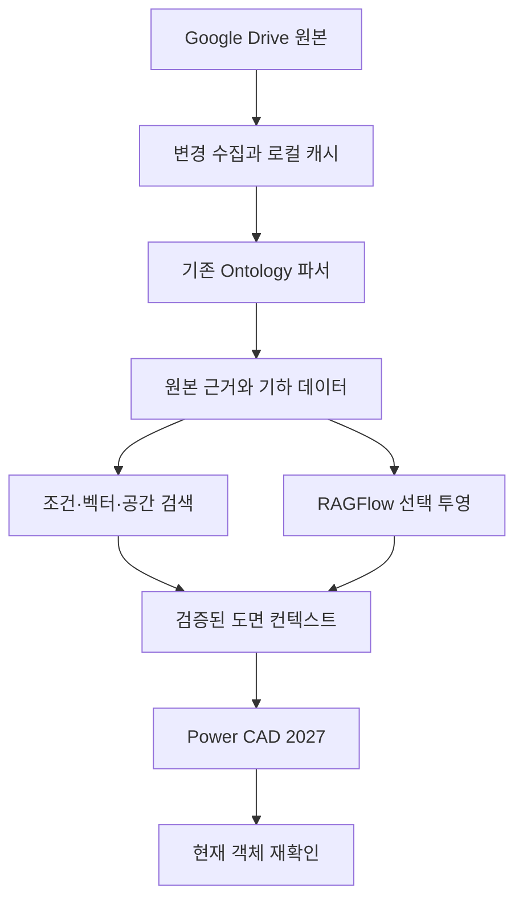

# 대량 건축도면 지식·검색·Power CAD 연동 프레임워크 v1

작성/검증일: 2026-09-29 (KST)

## 1. 최종 결정

Power CAD는 `khs0927/power-cad-mcp`를 유지한다. AutoCAD 2027의 C#/.NET 10
플러그인과 Named Pipe 경로가 주력이다. C++ ObjectARX는 측정된 병목과 Managed API
부족 부분에 추가한다. COM은 보조이다. 대량 수집을 위해 COM으로 도면을 하나씩 열지 않는다.

Ontology의 파서·CAIR·원본 provenance는 보존하고 외부에 재생성 가능한 검색 투영을 추가한다.
ArchOntos는 Drive inventory와 법규/근거 판정에 연계한다. 두 저장소의 canonical DB를
합치거나 동시에 쓰지 않는다. 객체·관계 교환은 source/revision ID와 근거를 포함한 계약으로 한다.

RAGFlow는 **선택적 검색·질의 UI 서비스**로 채택한다. CAD 원본 저장소나 좌표/handle의
최종 권위로 사용하지 않는다. 실행 자원 확인 전 기본 서비스로 자동 기동하지 않는다.
Google Drive의 여유 용량은 원본·스냅샷·백업에 유용하지만 CPU/RAM/GPU/SSD를 대체하지 않는다.

## 2. 구성과 책임

- 원본 파일과 canonical 객체: 기존 Ontology 소유.
- Drive 계정·corpus·file ID·변경 커서: ArchOntos inventory 소유.
- 검색 인덱스·미리보기·임베딩: 재생성 가능한 파생물.
- 실시간 도면 DB·동적 블록·편집·검증: Power CAD 소유.
- 법규 버전·적용·판정: ArchOntos 소유.
- GraphRAG의 추정 관계: 후보로 저장. 법규 판정과 원본 관측 사실을 대체하지 않는다.

## 3. 전체 도면 분석에 MCP가 필요한가

필요하지 않다. 수집 워커가 파서를 직접 호출하여 구조화하고 색인한다.
MCP는 사용자의 검색·조회·검증·편집 요청과 작업 상태 확인에 사용한다.
도면 하나당 여러 번 LLM을 호출하거나 객체 하나당 MCP를 왕복하는 경로는 기본 설계에서 제외한다.

경로를 세 가지로 나눈다.

1. **일괄 읽기**: 기존 ODA→ezdxf 경로를 우선 재사용. ACadSharp 읽기 전용 경로는 샘플
   검증 후 보조로 도입. DWG binary를 이해하는 파서가 필요하며 JSON 변환 자체가 DWG 해석을
   해결하지는 않는다.
2. **고정밀 보완**: 동적 블록·프록시·커스텀 객체·누락된 XREF·불확실 기하가 있으면
   설치된 AutoCAD 2027의 네이티브 읽기 워커로 보낸다. Side Database/Core Console은
   구현 후보이며 이 패키지에서 빌드/실행 검증되지 않았다. 독립 실행형 프로그램에서
   AutoCAD DLL을 참조하는 것만으로 네이티브 DB를 사용할 수 있다고 가정하지 않는다.
3. **현재 도면 작업**: 필요한 도면만 Power CAD에서 열고 현재 객체/지문을 확인한다.

ObjectARX는 다중 스레드 접근을 지원하지 않는다. CAD API 작업은 호스트의 허용 실행 문맥에
직렬화한다. 파일별 별도 프로세스의 동시성은 RAM·라이선스·호스트 검증 결과로 제한한다.
일반 파싱/OCR/임베딩 워커의 병렬 처리와 CAD DB 접근을 구분한다.

## 4. 좌표와 형태만 변환하면 되는가

좌표는 필요하지만 객체 의미와 원본 재선택까지 해결하지 못한다. 다음 레이어를 보존한다.

| 계층 | 보존할 항목 | 이유 |
|---|---|---|
| 원본 | provider ID, 캡처 해시, 원본 개정, parser/options version | 다른 파일·개정 혼동 방지 |
| 기하 | 선 끝점, 원/호, bulge, spline 제어점/차수/knot, hatch loop, 3D 여부 | 이미지·단순 선분화에서 손실 방지 |
| 좌표 | WCS/OCS/UCS, 단위, 원점, 변환행렬, layout, viewport | 픽셀 좌표와 실제 CAD 좌표 구분 |
| 블록 | definition와 instance, 중첩 경로, 회전/스케일/반전, 속성, dynamic state | 동일 블록의 여러 인스턴스 구별 |
| 참조 | XREF 원본 및 개정, 삽입변환, 순환/누락 상태, proxy 종류 | 외부참조 handle을 본도면 객체로 오인 방지 |
| 표현 | 레이어, ACI/TrueColor, ByLayer/ByBlock, 선종류, 문자/치수 스타일 | 기존 사무소 표현 재사용 |
| 의미 | 실명, 문번호, 도면명, 층, 치수 연계, 문–벽–실 후보 관계 | 선을 벽/문으로 해석할 근거 |

정밀 곡선은 원본 정의를 남기고 검색용 선분 근사에는 허용오차를 기록한다.
ByLayer/ByBlock은 원래 값과 해석된 표시값을 함께 저장한다.
두 평행선이 벽일 수도, 치수선·가구일 수도 있다. 분류는 관측값/계산값/추정값/사용자확정을 구분한다.
2D에서 높이·재료·내부 공간을 확정할 수 없으면 unknown으로 남긴다.

## 5. 검색 단위와 저장 형태

도면 전체 → 도곽/뷰/상세 영역 → 객체 묶음 → 개별 handle의 4단계로 검색한다.
한 ModelSpace 안에 여러 층과 도곽이 있을 수 있으므로 layout=층으로 해석하지 않는다.
도곽 분할은 블록/문자/공간 군집의 증거를 합치고 미확정 영역은 검수한다.

- 구조화 DB: 프로젝트, 파일, 개정, 승인본, 도면번호, 층, source locator.
- 기하 저장: JSONL/Parquet 파생 파일, bbox 공간 인덱스, 블록 definition 공유.
- 벡터 DB: 도면/영역/객체군의 요약·검색어. 수백만 개 선을 전부 임베딩하지 않는다.
- 그래프: contains, instance_of, xref_of, annotates, adjacent_to, connects 후보 관계.
- 원본 연결: account/corpus/file ID + captured revision/hash + layout + handle + instance path.

기본 검색은 기존 PostgreSQL+pgvector를 활용한다. 참고 구현의 SQLite는 계약 검증용이다.
Qdrant는 시각 다중벡터 검색의 효과가 확인될 때 추가한다. 처음부터 pgvector/Qdrant/Neo4j/AGE를
모두 필수로 배포하지 않는다. 관계 테이블의 제한된 탐색으로 시작하고 필요한 그래프 투영만 켠다.

검색은 권한·현재 개정·프로젝트 필터 → 정확한 코드/문자 검색 + 다국어 벡터 검색 → RRF →
상위 후보 재순위화 → 필요한 관계/기하만 확장의 순서이다. LLM에는 전체 좌표가 아닌 제한된
컨텍스트와 기하 참조를 전달한다. 수량/거리/면적은 기하 엔진으로 계산한다.

## 6. Drive 수집 및 빠른 처리

1. 전체 목록 수집 전 계정/corpus별 시작 change token을 확보한다.
2. files.list 모든 페이지 및 shared drive 범위를 기록한다. incompleteSearch는 완료로 처리하지 않는다.
3. 파일 이동/이름 변경은 file ID로 추적한다. 바로가기 target, Google 문서 export 경로는 별도 처리한다.
4. 캡처 전/후 provider revision metadata를 비교하고 캡처 bytes의 SHA-256을 계산한다.
   다운로드 중 변경되면 재시도한다. API version을 binary revision ID와 혼동하지 않는다.
5. 내용 해시+파서+설정별 재사용. ACL/source identity는 동일 bytes라도 파일마다 유지한다.
6. 변경 목록을 이어 받아 수정·삭제·권한 회수를 반영한다. 접근 회수 시 조회 게이트는 즉시 차단하고
   RAGFlow·벡터·미리보기 삭제는 별도 durable 작업으로 완료한다.
7. 429/일시 장애는 지수 backoff+jitter; cursor는 페이지 저장과 함께 확정한다.
8. 로컬 SSD에 제한된 hot cache, Drive에 원본·불변 파생물·논리 백업을 둔다.

대량 병렬화는 bounded queue, 파일 크기별 lane, 다운로드/CPU/OCR/GPU/native 작업 분리,
process timeout, lease/heartbeat, 실패 재시도 한도, 독성 파일 격리로 제어한다.
parse 산출물은 temp→checksum→atomic publish로 만든다. parser/options 변경도 캐시 키를 바꾼다.
최근/빈번/진행 중 프로젝트부터 처리하고 나머지는 백그라운드로 진행한다.

**검색 가능한 목록**과 **객체까지 분석 완료** 상태를 분리한다.
DISCOVERED → CAPTURED → PARSED/PARTIAL → INDEXED → NATIVE_VERIFIED는 별도 증거를 요구한다.
자료 전체를 즉시 이해했다고 보고하지 않는다. 원시 객체 수, 정규화 수, 미지원/실패 수를 함께 기록한다.

전체 시간은 데이터 없이 약속하지 않는다. 초기 측정으로
`T ≈ max(다운로드 bytes/실효대역폭, CPU 총시간/유효worker, GPU 총시간/GPUworker) + 직렬단계/재시도`
를 추정한다. warm 검색 목표와 cold DWG 다운로드·열기 시간을 별도로 측정한다.

## 7. RAGFlow 편입 방안

**선택 서비스로 편입하되 기존 원본과 파서는 보존한다.**

- CAD: Ontology가 만든 검증된 요약·텍스트·미리보기·외부 ID만 RAGFlow로 투영한다.
- 문서: Docling 결과를 공통 근거 형식으로 정리하고 동일 외부 ID 매핑을 사용한다.
- RAGFlow의 chunk ID → projection ID → 원본 개정/객체 매핑 테이블을 별도로 유지한다.
- RAGFlow에서 얻은 검색 점수·설명은 후보이다. native handle은 canonical registry에서 재해결한다.
- 원본 관리 권한을 주지 않는다. 리인덱싱/삭제가 기존 CAIR·DWG를 변경해서는 안 된다.
- UI에서 직접 답변을 제공할 경우 dataset 격리 및 ACL/삭제 동기화를 먼저 통과해야 한다.
  그 전에는 인증된 컨텍스트 게이트 뒤에서만 검색 결과를 사용한다.
- 현재 DTO exporter는 서버별 API payload가 아니다. 선택한 RAGFlow release의 API로 변환하고
  업로드/재시도/삭제/개정교체 계약 테스트를 거친 뒤 활성화한다.
- RAGFlow main은 Go 기반 전환을 안내하고 과거 버전 문서는 Python 배포를 설명한다.
  main과 구버전 Docker/API 설명을 섞지 않는다. 검증된 release image digest를 고정한다.
- 권장 시작 자원은 공식 README의 CPU 4코어/RAM 16GB/디스크 50GB 수준이며 데이터·모델에
  따라 늘어난다. Drive 용량은 런타임 자원이 아니다. live DB를 Drive 동기화 폴더에 두지 않는다.

무료 원칙은 추가 유료 API 비활성화, 로컬 임베딩/선택 OCR 모델, 기존 라이선스 내 CAD 사용으로
설계한다. 무료 소프트웨어라도 실제 전기·컴퓨팅·스토리지 비용이 0이라고 보장하지 않는다.
ODA 변환기는 오픈소스가 아니며 배포/자동화 조건은 설치 환경에서 확인한다.

## 8. 오픈소스 재사용 결정

| 구성 | 선택 | 범위 |
|---|---|---|
| DXF | ezdxf (MIT) | 기존 파서 유지, renderer/해당 기능 재사용 |
| DWG 보조 | ACadSharp (MIT), v3.8.0 관찰 | 네이티브 미실행 사전 읽기, 완전지원 가정 금지 |
| PDF/문서 | Docling (MIT), v2.131.0 관찰 | 표/본문/페이지 좌표; 모델 라이선스 별도 |
| OCR | PaddleOCR 후보 | 스캔 페이지만, 한글 샘플·자원 측정 후 |
| 공간 연산 | Shapely (BSD-3-Clause) | STRtree/관계 계산, 정확 곡선 원본 별도 보존 |
| BIM | IfcOpenShell 기존 어댑터 | IFC GlobalId와 원본 연결 |
| 임베딩 | Sentence Transformers v6.1.0 관찰 | BGE-M3/Qwen 임베딩 후보 비교, 모델 commit 고정 |
| 시각 검색 | Sentence Transformers MultiVectorEncoder + ColQwen 후보 | colpali-engine 신규 도입 안 함 |
| 검색 DB | pgvector 우선 / Qdrant v1.19.1 선택 | 한 번에 필요한 엔진만 |
| 문서 UI | RAGFlow 선택 | 검색 투영 및 근거 UI |
| GraphRAG | 기존 관계+제한 탐색 우선 / LightRAG 선택 | 검증되지 않은 추론 관계 분리 |
| 전송/백업 | Google API client + rclone (MIT) | Drive changes와 논리 백업, 양방향 DB 동기화 금지 |
| CAD 의미/시각 근거 | best-cad-mcp (MIT) | 알고리즘·계약 참고/선별 이식, COM 실행 경로 대체 금지 |

관찰한 버전은 비교 근거이며 설치·호환성 고정 lockfile이 아니다. 모델 가중치는 코드 라이선스와 별도 확인한다.

## 9. 현재 저장소에서 발견한 통합 위험

- `operational/parsers.py`는 source.parent.name을 source_hash로 쓴다. bytes hash 디렉터리로
  staging해야 기존 로직과 일치한다. historical mismatch는 확장 어댑터가 거부한다.
- `operational/worker.py`는 같은 doc/revision 경로에 write_text를 한다. 새 수집 경로는
  기존 worker를 전체 교체하지 않고 불변 artifact 발행 계층을 앞에 둬야 한다.
- 기본 doc ID가 파일 stem에서 만들어지는 경우 동명이인 도면 충돌 가능성이 있다.
  Drive account/corpus/file ID에서 안정 ID를 만들어 명시적으로 전달한다.
- 기존 `embeddings.py`는 서로 다른 모델/해시 fallback을 같은 이름/차원으로 저장할 수 있다.
  새 EmbeddingSpace를 별도 namespace에 사용하고 실측 전 기존 벡터를 섞지 않는다.
- operational 검색의 예외 후 SQL fallback은 동일 DB transaction 실패 상태를 고려해야 한다.
  production adapter에서 extension capability 검사/savepoint/rollback을 확인한다.
- 기존 CAD 의미 분류는 규칙 후보이며 모든 도면의 실/문/벽 인식이 검증된 것은 아니다.

위 항목은 기존 파일을 수정해 해결했다고 주장하지 않는다. 이 확장은 잘못된 근거의 전파를
차단하며 필요한 upstream 개선을 별도 티켓으로 남긴다.

## 10. 단계별 수용 기준과 롤백

G0 (이번 구현): 기존 파서 무변경, snapshot 변환, 로컬 전문검색, revision/ACL guard,
projection DTO, handoff guard, 실제 DXF 통합 시험. 단위·계약 검증 완료.

G1: Drive 실제 API 인증/갱신, 전체 페이지·삭제·변경 replay, 파일 캡처 중 변경 검증,
20개 대표 DWG+PDF+문서, 고정 질문 30개. 이 패키지는 실제 Drive 수집을 실행하지 않았다.

G2: PostgreSQL 투영, 다국어 임베딩, 모델 namespace 검사, 도곽/영역 분할,
정확 코드/개정 recall과 검색 지연 측정. top-5 정답 회수율 95%는 목표이며 달성 보고가 아니다.

G3: Power CAD 2027 네이티브 동일 도면/개정/handle 재확인, nested block/XREF/단위/
PaperSpace/dirty drawing/삭제 객체 테스트. 잘못된 대상 검증 통과 0건을 release gate로 둔다.

G4: RAGFlow release 고정, projection import/delete/revision 교체, 권한 회수와 UI 검증.
승격 전 동일 고정 질문 세트로 provenance metadata 100%, unauthorized source leakage 0,
stale revision leakage 0, Recall@5 >= 0.80, MRR >= 0.60을 모두 통과한다.
p50/p95, 색인 시간, 저장공간은 첫 실측에서는 비교 지표로 기록하고 곧바로 hard gate로 만들지 않는다.
시각 검색/GraphRAG는 G2 대비 정확도 개선과 비용을 측정해 유지 여부를 정한다.

G5: 전체 Drive backfill과 변경분 운영. queue lag, parse throughput, unsupported ratio,
cache hit, p50/p95, native fallback ratio, 백업 복원과 재색인 측정.

롤백: feature flag 해제 → 확장 검색/작업 중단 → 파생 인덱스 폐기/재구축.
기존 Ontology canonical 데이터와 Power CAD 수정 기능은 변하지 않는다.

## 11. 확인한 공식 근거

- Autodesk 2027 SDK 환경/재빌드/단일 스레드:
  https://blog.autodesk.io/autocad-2027-sdk-what-every-plugin-developer-needs-to-know/
- 공식 SDK 요구사항: https://aps.autodesk.com/developer/overview/objectarx-autocad-sdk
- 2027 및 2027.1 기능:
  https://help.autodesk.com/cloudhelp/2027/ENU/AutoCAD-WhatsNew/files/GUID-D52A51CA-BDA1-4A78-9E67-87B340C55490.htm
- Drive changes: https://developers.google.com/workspace/drive/api/guides/manage-changes
- Drive 다운로드: https://developers.google.com/workspace/drive/api/guides/manage-downloads
- Drive quota: https://developers.google.com/workspace/drive/api/guides/limits
- RAGFlow: https://github.com/infiniflow/ragflow
- 버전별 RAGFlow MCP: https://ragflow.io/docs/v0.27.2/mcp_tools
- ColPali migration: https://github.com/illuin-tech/colpali
- 각 오픈소스 저장소는 `sources.json`에 기록.

공식 개발 블로그가 링크한 C++/.NET 상세 API delta 페이지는 조사 시 Page Not Found였다.
따라서 특정 신규 API를 검증했다고 주장하지 않는다. 설치 SDK의 migration guide와 헤더로
확정해야 한다. Core Console/Side Database는 기존 기술이며 2027 신기능으로 분류하지 않는다.
