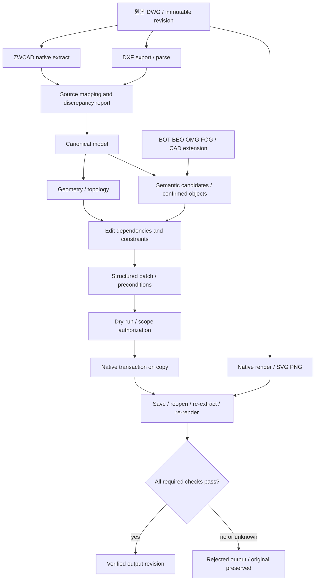

# 아키텍처와 계약

## 목표 구성



위 그림은 목표 구조다. v0.1 실행 경로는 DXF → Canonical → 끝점 위상/의미 후보 → Patch 시뮬레이션, DXF → SVG 미리보기까지다.

## 식별자

| 필드 | 규칙 |
| --- | --- |
| `drawing_id` | 호출자가 관리하는 논리 도면 식별자. 파일명 변경과 분리 |
| `revision` | 현재 입력 파일 바이트의 SHA-256. 동시 변경 감지용 |
| `Entity.id` | v0.1: drawing ID + Model + handle의 UUID5 |
| `SourceRef` | drawing ID, revision, format, layout, handle, insert path |
| `SemanticObject.id` | 원본 primitive와 별도. 현재는 후보별 ID |
| `Patch.expected_revision` | 분석 당시 revision. 다르면 계획 거부 |

Handle 단독으로 전역 ID를 만들지 않는다. v0.1은 같은 DXF 계열에서 같은 논리 ID와 handle이 유지될 때 추적 가능하다. 객체 삭제·복제·폭파·재생성에는 lineage mapping이 추가로 필요하다. 원본 DWG의 handle과 DXF의 handle을 동일시하지 않는다.

블록 지원 때는 `owner drawing + layout + insert instance chain + definition entity handle`을 포함하도록 identity 구현과 스키마 버전을 함께 확장한다. Xref는 외부 도면 ID·revision·삽입 문맥·resolve 상태를 보존하고 기본 읽기 전용이다.

## Canonical 모델

실행 계약의 기준은 `src/god_cad/models.py`다. `schemas/*.schema.json`은 여기서 생성한다. 임의 필드는 거부하고 숫자는 유한값만 허용한다. JSON Schema는 형식 검사를 돕지만 참조 무결성·버전·영향 분석 같은 런타임 검사를 대체하지 않는다.

| 객체 | 현재 필드 / 의미 |
| --- | --- |
| Drawing | revision, units, scope, entities, semantic_objects, edges, warnings |
| Entity | source, CAD type, layer, locked, geometry, support status, limitations |
| Geometry | kind, WCS mm points, radius, degree angles, closed |
| SemanticObject | class URI, candidate status, 원본 entity 목록, 증거 |
| Evidence | method, value, score, calibrated=false |
| Edge | source, target, graph, relation, evidence |
| Patch | 대상·revision·연산·mm 벡터·이유 |
| PlanReport | 거부/시뮬레이션 통과, 오류, 영향 대상, 전후 기하, native_write_eligible=false |

v0.1은 Geometry를 Entity에 포함한다. 대용량 저장 도입 시 geometry payload를 별도 blob으로 분리하고 checksum 참조를 둔다. 그래프에 모든 vertex를 개별 지식 노드로 넣을 필요는 없다.

## 그래프의 의미

- `topology / touches_at_endpoint`: 0.1 mm 이하의 끝점 거리. 논리적으로 대칭이다. 공간 인접성·구조 연결성을 뜻하지 않는다.
- `semantic / represented_by`: 미확정 의미 후보 → 원본 entity. 원시 객체 한 개의 레이어에서 생성하므로 완성된 벽 인스턴스가 아니다.
- `edit / requires_update`: source 변경 시 target 재검토/갱신 필요. 방향성이 있다. 계약과 순회는 구현됐고 자동 추출은 미구현이다.

위상 추출은 현재 O(n²) 끝점 비교다. 대형 실도면에는 공간 인덱스, 교차점·근접·폐영역 검출과 계산량 제한을 먼저 구현한다. 원·호·닫힌 폴리라인의 연결과 폴리라인 내부 정점 접촉은 현재 위상 범위에서 빠진다.

## 단위와 좌표

입력 `$INSUNITS`에서 mm/cm/m/in/ft를 판별해 mm로 정규화한다. 단위를 알 수 없으면 호출자가 명시해야 한다. 수동 지정 사실은 `unit_evidence=user_override`로 남는다. 도면 좌표는 WCS의 XY 평면만 지원한다. OCS가 기본 +Z가 아니거나 Z/두께가 0이 아니면 미지원으로 남긴다.

LWPOLYLINE bulge·폭은 직선으로 강제 변환하지 않는다. TEXT, INSERT, DIMENSION, HATCH, SPLINE, proxy와 다른 미지원 객체는 목록·원본 handle·종류·레이어·누락 사유를 보존한다. 이 기록은 원본 객체 전체를 직렬화했다는 뜻이 아니다. 원본 파일이 전체 데이터의 보존 수단이다.

## 수정 계약

실행 예제는 `python scripts/demo.py`가 실제 ID와 revision을 사용해 생성한다.

```json
{
  "schema_version": "0.1.0",
  "patch_id": "request-001",
  "drawing_id": "logical-floor-id",
  "expected_revision": "<실제 입력 파일의 64자리 SHA-256>",
  "operation": "TRANSLATE_ENTITIES",
  "target_ids": ["<drawing.json의 실제 Entity.id>"],
  "vector_mm": [300, 0, 0],
  "reason": "대상 도형의 XY 이동 사전 검토"
}
```

위 JSON은 필드 설명용이므로 꺾쇠 자리표시자는 실제 값으로 바꿔야 한다. `MOVE_WALL`이나 자연어는 v0.1 API의 유효한 연산이 아니다.

시뮬레이터는 끝점 관계를 다시 계산하고 edit edge의 영향 범위를 순회한다. 알려진 영향 대상이 빠지면 거부한다. 모든 대상을 넣으면 동일 벡터 이동만 시뮬레이션한다. 이 결과는 벽 연장, 치수 재계산, 충돌 검사나 설계 적합성 검증을 포함하지 않는다.

## 저장소와 인터페이스 결정

Python 코어는 CLI로 호출하고 내부 함수는 별도 모듈로 유지한다. v0.1에는 API 서버, 외부 LLM 호출, DB 서버, MCP 서버를 넣지 않는다. 향후 `query → plan → preview → execute → verify`의 제한된 도구 인터페이스를 노출한다. LLM은 관련 객체와 증거만 조회하며 전체 도면 좌표를 매번 프롬프트에 전송하지 않는다.

PostgreSQL/파일 저장소는 이력·대용량 artifact 수요가 생기면, graph DB는 다단 관계 질의의 실제 성능 요구가 확인되면 도입한다. Neo4j/n10s 사용 여부는 선택 사항이며 v0.1 의존성이 아니다.
